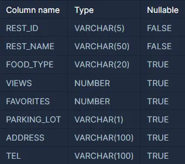

## 1.SQL은 무엇인가? 어떨 때 쓰나요?

SQL은 데이터베이스(DB)에서 데이터를 다루기 위한 언어입니다.

SQL(Structured Query Language)으로 “구조화된 데이터를 질의하기 위한 언어”로 주로 **관계형 데이터베이스(RDBMS)에서 데이터를 삽입, 조회, 수정, 삭제(CRUD)할 때 사용**한다.

### 어떨 때 쓰이나요?

- 정보 찾기: 예를 들어, "지난달에 가장 많이 팔린 상품은 무엇인가?"라는 질문에 답하기 위해 사용됩니다.
- 정보 입력 및 수정: 새로운 상품 정보를 데이터베이스에 추가하거나, 기존 정보를 수정할 때 사용됩니다.
- 정보 삭제: 예전에 사용하던 상품 정보나 더 이상 필요 없는 정보를 제거할 때 사용됩니다.
- 리포트나 통계: 여러 가지 정보를 종합하여, 예를 들어 "올해 가장 많은 이익을 낸 분기는 언제인가?" 같은 질문에 답할 수 있습니다.

### 1-1. 테이블과 컬럼이란

### 테이블 (Table)

테이블은 데이터베이스의 핵심 구성 요소 중 하나로, 행(row)과 열(column)을 가진 "표"와 유사한 형태로 데이터를 저장합니다. 각 테이블은 특정한 "주제"나 "개념"에 대한 정보를 모아 놓습니다. 예를 들어, "고객" 테이블은 고객에 관한 정보를, "주문" 테이블은 주문에 관한 정보를 저장할 수 있습니다.



### 컬럼 (Column)

테이블 내에서 컬럼은 "필드"나 "속성"이라고도 하며, 테이블에서 관리하려는 각각의 정보 유형을 나타냅니다. 예를 들어, "고객" 테이블의 경우 컬럼은 '고객ID', '이름', '이메일 주소', '전화번호' 등이 될 수 있습니다.


### 2. 프로그래머스에서 사용할 수 있는 두 개의 DB

### MySQL

- 간단하고 직관적입니다. MySQL은 작은 규모의 애플리케이션에 적합하며, 쉽고 간단한 문법을 가지고 있습니다.
- MySQL은 오픈 소스 커뮤니티에서 널리 사용되므로, 문제 해결을 위한 자료가 풍부합니다.
- 빠른 처리 속도를 가지고 있습니다. 간단한 쿼리에 대한 처리 속도가 빠르고, 설정이 쉽습니다.

### Oracle

- 고급 기능을 사용하는 데 유리합니다. 복잡한 쿼리와 트랜잭션을 처리하는 데 필요한 다양한 고급 기능을 제공합니다.
- 확장성이 좋습니다. 대규모 데이터베이스와 복잡한 쿼리 처리에 적합합니다.

### 3. 코딩 테스트를 위한 SQL 문법(중요)

**작성 순서**
> **SELECT - DISTINCT -FROM - JOIN - ON - WHERE - GROUP BY - HAVING - ORDER BY - LIMIT - OFFSET**

**실행 순서**
> **FROM → WHERE → GROUP BY → HAVING → SELECT → ORDER BY → LIMIT**


- SELECT: 조회할 열(column)을 지정합니다.
- DISTINCT: 중복된 결과를 제거합니다 (선택적).
- FROM: 데이터를 가져올 테이블을 지정합니다.
- JOIN: 다른 테이블과의 조인을 정의합니다.
- ON: 조인의 조건을 정의합니다.
- WHERE: 특정 조건에 맞는 레코드를 필터링합니다.
- GROUP BY: 결과를 특정 열로 그룹화합니다.
- HAVING: GROUP BY로 그룹화된 결과에 추가적인 필터링을 적용합니다.
- ORDER BY: 결과를 특정 열을 기준으로 정렬합니다.
- LIMIT: 반환할 레코드의 수를 제한합니다.
- OFFSET: 반환할 레코드의 시작점을 지정합니다. (페이지네이션)

```sql
SELECT DISTINCT E.first_name, E.last_name
FROM EMPLOYEES AS E
JOIN DEPARTMENTS AS D
ON E.department_id = D.department_id
WHERE E.salary > 50000
GROUP BY E.first_name, E.last_name
HAVING COUNT(E.employee_id) > 1
ORDER BY E.first_name ASC, E.last_name DESC
LIMIT 10;
```

- 너무 길어지는 코드는 AS로 줄인다.

```sql
SELECT
    USED_GOODS_BOARD.TITLE,
    USED_GOODS_BOARD.BOARD_ID,
    USED_GOODS_REPLY.REPLY_ID,
    USED_GOODS_REPLY.WRITER_ID,
    USED_GOODS_REPLY.CONTENTS,
    DATE_FORMAT(USED_GOODS_REPLY.CREATED_DATE, '%Y-%m-%d') AS FORMATTED_CREATED_DATE
FROM
    USED_GOODS_BOARD
JOIN
    USED_GOODS_REPLY
ON
    USED_GOODS_BOARD.BOARD_ID = USED_GOODS_REPLY.BOARD_ID
WHERE
    MONTH(USED_GOODS_BOARD.CREATED_DATE) = 10 AND YEAR(USED_GOODS_BOARD.CREATED_DATE) = 2022
ORDER BY
    USED_GOODS_REPLY.CREATED_DATE,
    USED_GOODS_BOARD.TITLE;
```

```sql
SELECT
    B.TITLE,
    B.BOARD_ID,
    R.REPLY_ID,
    R.WRITER_ID,
    R.CONTENTS,
    DATE_FORMAT(R.CREATED_DATE, '%Y-%m-%d') AS FORMATTED_CREATED_DATE
FROM
    USED_GOODS_BOARD AS B
JOIN
    USED_GOODS_REPLY AS R
ON
    B.BOARD_ID = R.BOARD_ID
WHERE
    MONTH(B.CREATED_DATE) = 10 AND YEAR(B.CREATED_DATE) = 2022
ORDER BY
    R.CREATED_DATE,
    B.TITLE
LIMIT
	10;
```

### 4. 실제 문제 분석

[서울에 위치한 식당 목록 출력하기](https://school.programmers.co.kr/learn/courses/30/lessons/131118)

> REST_INFO와 REST_REVIEW 테이블에서 서울에 위치한 식당들의 식당 ID, 식당 이름, 음식 종류, 즐겨찾기수, 주소, 리뷰 평균 점수를 조회하는 SQL문을 작성해주세요. 이때 리뷰 평균점수는 소수점 세 번째 자리에서 반올림해주시고 결과는 평균점수를 기준으로 내림차순 정렬해주시고, 평균점수가 같다면 즐겨찾기수를 기준으로 내림차순 정렬해주세요.
>

```sql
/*식당 ID, 식당 이름, 음식 종류, 즐겨찾기수, 주소, 리뷰 평균 점수를 조회*/
SELECT 
    I.REST_ID,
    I.REST_NAME,
    I.FOOD_TYPE,
    I.FAVORITES,
    I.ADDRESS,
    ROUND(AVG(R.REVIEW_SCORE),2) AS SCORE /*리뷰 평균점수는 소수점 세 번째 자리에서 반올림*/
FROM  /*REST_INFO와*/
    REST_INFO AS I
JOIN /*REST_REVIEW 테이블에서*/
    REST_REVIEW AS R
ON
    I.REST_ID = R.REST_ID
WHERE
    I.ADDRESS LIKE "서울%"  /*서울에 위치한*/
GROUP BY
    I.REST_ID
ORDER BY /*결과는 평균점수를 기준으로 내림차순 정렬해주시고, 평균점수가 같다면 즐겨찾기수를 기준으로 내림차순 정렬*/
    SCORE DESC, I.FAVORITES DESC;
```

### 5 알아두면 좋을 팁

> Column에서 NULL이 나타나면 어떻게 처리할 것인가?
>
> **1. WHERE 절에서 NULL 제외**
>
> NULL 값을 제외하려면 WHERE 절에 조건을 추가합니다.
>
> ```sql
> WHERE TLNO IS NOT NULL
> ```
>
> **2. NULL을 특정 값으로 대체 (COALESCE)**
>
> COALESCE 함수를 사용하여 NULL 값을 특정 값으로 대체할 수 있습니다.
>
> ```sql
> SELECT COALESCE(TLNO, 'N/A') AS TLNO, MEMBER_ID, MEMBER_NAME, GENDER, DATE_OF_BIRTH
> ```
>
> **3. CASE 문으로 처리**
>
> CASE 문을 사용하여 NULL값을 특별히 처리할 수 있습니다.
>
> ```sql
> SELECT
>     CASE
>         WHEN TLNO IS NULL THEN 'N/A'
>         ELSE TLNO
>     END AS TLNO,
>     MEMBER_ID, MEMBER_NAME, GENDER, DATE_OF_BIRTH
> FROM MEMBER_PROFILE
> ```
>
> 데이터의 갯수를 세야한다면 COUNT로(단, SELECT에서만 사용 가능)
>
> ```sql
> SELECT COUNT(USER_ID) AS USERS
> ```
>
> 문자열 데이터 중 특정 값을 찾아야 한다면 %로
>
> ```sql
> WHERE
>     ADDRESS LIKE '경기도%'
> ```
>
> MAX, MIN은 SELECT에서만 사용할 수 있다. 그래서 이런 코드가 나온다.
>
> ```sql
> WHERE PRICE = (SELECT MAX(PRICE) FROM FOOD_PRODUCT);
> ```
>

# 알아두면 좋은 함수(정리)
### 

## 1. SELECT
### 사용 가능한 함수들
1. 집계 함수 (COUNT, SUM, AVG, MAX, MIN)
### 주의사항


## 2. FROM
### 정의

## 3. JOIN
### 정의

### (1). JOIN을 해야할 때. 두 개의 테이블에서 값을 가져와야 할 때
> JOIN과 ON : JOIN과 ON 문법은 주로 두 개 이상의 테이블에서 데이터를 결합할 때 사용됩니다. JOIN의 종류에는 INNER, LEFT, RIGHT가 있습니다. 여기서는 가장 기본적인 INNER JOIN에 대해 알아보겠습니다.
>

> 가져올 테이블을 JOIN 뒤에 적어주고, 두 테이블의 공통된 열을 지정하여 어떻게 연결되어야 하는지 지정하기 위해 ON 문법을 사용해주면 됩니다.
>
>
> ```sql
> SELECT employees.name, departments.name
> FROM employees
> JOIN departments
> ON employees.departmentID = departments.id;
> ```
>
## 4. WHERE
### 정의

### 주의사항
1. 집계함수 쓰지마라!!

## 5. GROUP BY
### 정의

### 주의사항
1. 모든 일반 컬럼을 GROUP BY에 포함시켜야 한다!(그렇지 않으면 에러가 터진다!)
2. GROUP BY가 있을 경우, GROUP BY에 포함된 컬럼과 집계함수만 SELECT에 올 수 있다.
3. WHERE로 먼저 행을 거르고 → GROUP BY로 묶고 → HAVING으로 그룹 필터링하는 순서이다.

## 6. HAVING
### 정의

### 사용 가능한 함수들
1. 집계 함수 (COUNT, SUM, AVG, MAX, MIN)

### 주의사항
1. WHERE로 거를 수 있는걸 HAVING으로 거르지마라.(비효율적임)
2. **HAVING에서는 집계 함수 또는 GROUP BY에 포함된 컬럼만 사용 가능하다.**
3. 그룹 다 만든 후에 작동하므로 데이터 많을수록 느리다.

## 7. ORDER BY
### 정의

### (1). ORDER BY: 정렬 기준을 두개를 주고 싶다면 ?
> '주문량을 기준으로 내림차순 정렬하고 총주문량이 같다면 출하 번호를 기준으로 오름차순 정렬하여' 라는 문제가 있다면,
>
```sql
ORDER BY TOTAL_ORDER DESC, SHIPMENT_ID;
```
## 8. LIMIT
### 정의

## 9. OFFSET
### 정의

# 2. 알아두면 좋은 함수(정리)
## 1. 집계 함수 (COUNT, SUM, AVG, MAX, MIN)
**특징** : 이 함수들은 하나 이상의 행을 묶어서 하나의 결과로 만든다는 특징이 있다.<br>
**사용 가능 위치** : SELECT, HAVING, ORDER BY<br>
**주의사항** : <br>
- `WHERE`절에서는 사용 불가(집계 전에 필터링이 이뤄지므로), 그룹별 계산 시 반드시 GROUP BY와 함께 사용해야한다.<br>
- `GROUP BY`를 쓰지 않고 SELECT에 집계 함수를 사용하는 경우 전체에 대한 집계가 진행된다.

**각 함수 사용 예시** :
### COUNT() – 개수 세기
```sql
SELECT COUNT(*) FROM users; 전체 행 수<br>
SELECT COUNT(age) FROM users; → NULL 제외<br>
HAVING COUNT(*) >= 5 → 그룹 중 5개 이상인 것만<br>
ORDER BY COUNT(*) DESC → 그룹 크기 기준 정렬 (서브쿼리 또는 별칭 필요)
```
🔎 주의: COUNT(*)은 NULL 포함, COUNT(column)은 NULL 제외됨
### SUM() – 합계 구하기
```sql
SELECT SUM(price) FROM orders;
HAVING SUM(price) > 50000
ORDER BY SUM(price) DESC (보통 GROUP BY 뒤에서 쓰임)
```
### AVG() – 평균 구하기
```sql
SELECT AVG(salary) FROM employees;
HAVING AVG(salary) >= 4000
ORDER BY AVG(salary) (그룹 평균 기준 정렬)
```
🔎 주의: 0개인 그룹이면 NULL이 될 수 있음 → `COALESCE(AVG(...), 0)`처럼 처리 가능
### MAX() – 최대값(MIN()도 동일)
```sql
SELECT MAX(score) FROM scores;
HAVING MAX(score) >= 95
ORDER BY MAX(score) DESC (그룹별 최고점 정렬)
```
🔎 주의: 정렬 기준으로 자주 쓰이며, GROUP_CONCAT(MySQL만 있음)과 함께 조합 가능 (ex. 최고점 가진 학생)<br>
🔎 주의: MIN()도 NULL은 무시되지만 NULL만 있다면 결과를 NULL로 반환한다. NULL을 처리하고 싶으면 `COALESCE(MIN(col), 대체값)`을 사용한다.

---

## 2. 문자열 함수 (CONCAT, SUBSTRING, LENGTH, UPPER, LOWER 등)
**특징** : 이 함수들은 하나 이상의 행을 묶어서 하나의 결과로 만든다는 특징이 있다.<br>
**사용 가능 위치** : SELECT, WHERE, HAVING, ORDER BY<br>
**사용 상황** : 이름 붙이기, 문자열 길이 검사, 대소문자 통일, 일부 문자열 추출 등<br>
**주의사항** : <br>
- 문자열 길이(`LENGTH`)나 조작 연산은 인덱스를 무력화할 수 있음 → WHERE 절에서 쓰면 성능 저하 가능
- 정렬 시 대소문자 구분 방식(대소문자 우선 정렬 여부)이 DB 설정에 따라 달라질 수 있음

**각 함수 사용 예시** :

### CONCAT() – 문자열 이어붙이기
```sql
SELECT CONCAT(first_name, ' ', last_name) AS full_name
FROM users;

WHERE CONCAT(city, address) LIKE 'Seoul%' -- (❌ 비효율: 인덱스 안 탐)

ORDER BY CONCAT(first_name, last_name)
```
🔎 주의: WHERE에서 쓰면 인덱스 무시되므로 성능 저하 가능<br>
📌 SELECT에선 이름, 이메일 조합 등 자주 사용됨<br>
📌 **MySQL 기준으로 CONCAT()은 2개 이상 문자열 인자를 제한 없이 받을 수 있다.**

### SUBSTRING(문자열, 시작위치(MySQL은 1부터 시작), 추출할 문자 수) – 문자열 일부 추출
```sql
SELECT SUBSTRING(phone, 1, 3) AS area_code
FROM users;
SELECT SUBSTRING('abcdefg', -3); -- 결과: 'efg'
SELECT SUBSTRING('abcdefg', -4, 2); -- 결과: 'de'

WHERE SUBSTRING(user_id, 1, 2) = 'AB'

ORDER BY SUBSTRING(email, 1, 5)
```
📌 코드, 주민번호, 날짜 포맷 등 부분 추출에 자주 사용

### LENGTH(문자열) – 문자열 길이 확인
```sql
SELECT name, LENGTH(name) AS len
FROM users;

WHERE LENGTH(password) >= 12

ORDER BY LENGTH(email) DESC
```
🔎 주의: WHERE LENGTH(col) 은 인덱스 못 탐<br>
📌 길이 조건 필터링, 정렬, 데이터 유효성 검사 등에서 사용

### UPPER(), LOWER() – 대/소문자로 변환
```sql
SELECT UPPER(username) AS uname
FROM users;

WHERE UPPER(email) = 'ADMIN@SITE.COM'

ORDER BY UPPER(name)
```
🔎 주의: 정렬이나 비교 시 대소문자 차이를 무시하고 싶을 때 유용<br>
📌 사용자 입력 normalize 처리에 자주 사용

### LEFT(str, N), RIGHT(str, N) - 왼쪽/오른쪽부터 N글자 추출
```sql
SELECT LEFT('abcdef', 3); -- 결과: 'abc'
SELECT RIGHT('abcdef', 2); -- 결과: 'ef'
```
🔎 주의: WHERE 절에서 사용 시 인덱스 못 탐<br>
📌 대안: WHERE name LIKE 'A%' -- ✅ 인덱스 활용 가능

### REPLACE(str, from, to)
```sql
SELECT REPLACE('010-1234-5678', '-', '') AS phone;
-- 결과: '01012345678'
```
🔎 주의: WHERE 절에서 사용하면 마찬가지로 인덱스 무력화<br>
🔎 치환 대상 문자열이 없으면 → 원본 그대로 리턴<br>
🔎 대소문자 구분됨 (replace('ABC', 'a', 'x') → 'ABC')

### TRIM / LTRIM / RTRIM - 공백제거
```sql
SELECT TRIM('  hello  '); -- 'hello'
SELECT TRIM('.' FROM '...hello...'); -- 'hello'

SELECT LTRIM('...hello');              -- 결과: '...hello' (공백만 제거, 점은 안 지움)

SELECT RTRIM('hello...');              -- 결과: 'hello...' (공백만 제거)
```
🔎 주의: TRIM()은 공백만 제거 (기본)<br>
🔎 주의: 특수 문자 제거하려면 명시적으로 써야한다.<br>
🔎 주의: LTRIM과 RTRIM은 단순히 공백만 제거한다. TRIM만 저렇게 가능!

### LOCATE(substr, str) / INSTR(str, substr) - 문자열 찾기
```sql
SELECT LOCATE('cd', 'abcdef'); -- 3
SELECT INSTR('abcdef', 'cd'); -- 3
```
🔎 주의: 찾는 문자열이 없으면 → 결과는 0 (주의: NULL 아님!)<br>
🔎 문자열 시작 위치는 1부터 (0-based 아님)<br>
🔎 찾는 문자열이 여러개일 경우 처음 나온 위치만 반환한다.

### REVERSE(str) - 문자열 뒤집기
```sql
SELECT REVERSE('abc'); -- 'cba'
```
🔎 주의: 한글이나 이모지 같은 멀티바이트 문자는 뒤집힐 때 깨질 수 있음<br>
🔎 사용은 보통 시각적 목적 / 퍼즐 문제에서나 드묾

### LPAD(str, total_length, pad_string), RPAD() - 길이 맞추기
```sql
-- LPAD: 왼쪽 채움
SELECT LPAD('42', 5, '0'); -- 결과: '00042'
-- RPAD: 오른쪽 채움
SELECT RPAD('42', 5, '0'); -- 결과: '42000'
-- total_len보다 문자열이 길면 → 잘림 발생
SELECT LPAD('123456', 4, '0'); -- → '3456'
-- 패딩 문자 여러 개 써도 무조건 한 글자씩 반복됨
SELECT LPAD('X', 4, 'AB'); -- 'ABAX' ❌ 아님 → 'AAAX' ✅
```
🔎 주의: total_len보다 문자열이 길면 → 잘림 발생<br>
🔎 주의: 패딩 문자 여러 개 써도 무조건 한 글자씩 반복됨

---

## 3. 수학 함수 (ROUND, CEIL, FLOOR, ABS 등)
**특징** : 숫자 데이터를 반올림, 올림, 내림, 절댓값 등으로 조작할 수 있는 함수  
**사용 가능 위치** : SELECT, WHERE, HAVING, ORDER BY  
**사용 상황** : 가격 계산, 소수점 처리, 절댓값 거리 비교, 금액 반올림 등  
**주의사항** :
- `ROUND()`는 자리수 생략 시 소수점 이하 0으로 반올림됨
- `FLOOR()`와 `CEIL()`은 결과가 정수형으로 변환됨
- 문자열을 넘기면 자동으로 숫자로 변환하려 시도 (의도치 않은 결과 주의)
- 숫자 외 문자열이 들어오면 암묵적 형 변환 시도함
- 반올림/절삭 함수는 자리 수를 생략 시 정수 기준
- MOD는 DB마다 부호 처리 방식 다를 수 있음
- `WHERE`에서 계산식이 들어가면 **인덱스를 타지 않음**, 특히 `ROUND(col)` 형태 조심

**각 함수 사용 예시** :

### ROUND(x [, d]) – 반올림
```sql
SELECT ROUND(123.456);        -- 123
SELECT ROUND(123.456, 1);     -- 123.5
SELECT ROUND(123.456, -1);    -- 120

WHERE ROUND(score, 1) >= 80.0
ORDER BY ROUND(score, 2) DESC
```
🔎 d 생략 시 정수 단위 반올림<br>
🔎 d < 0이면 10단위/100단위로 반올림<br>
📌 가격 반올림, 소수점 처리에서 자주 사용됨<br>
📌 WHERE/HAVING에서도 자주 쓰임

### CEIL(x) – 올림
```sql
SELECT CEIL(12.1);     -- 13
SELECT CEIL(-1.1);     -- -1

WHERE CEIL(score) >= 90
ORDER BY CEIL(price)
```
🔎 소수점 존재하면 무조건 위 정수로 올림<br>
📌 음수는 더 작은 쪽(덜 음수)로 올림<br>
📌 할인 계산 등에서 자주 사용됨

### FLOOR(x) – 내림
```sql
SELECT FLOOR(12.9);    -- 12
SELECT FLOOR(-1.1);    -- -2
SELECT FLOOR(-5.1);	   -- -6

WHERE FLOOR(amount) < 100
ORDER BY FLOOR(value) DESC
```
🔎 소수점 존재하면 무조건 아래 정수로 내림<br>
📌 절사 금액 계산 등에 활용

### ABS(x) – 절댓값
```sql
SELECT ABS(-10);       -- 10
SELECT ABS(100 - price) FROM products;

WHERE ABS(score - 100) <= 5
ORDER BY ABS(balance)
```
🔎 항상 양수 반환<br>
📌 거리 비교, 오차 허용 범위 필터링 등에서 사용

### MOD(x, y) – 나머지 구하기
```sql
SELECT MOD(10, 3);     -- 1
SELECT MOD(-10, 3);    -- -1 (MySQL 기준)

WHERE MOD(id, 2) = 0   -- 짝수만

SELECT MOD(10, 3);	-- 1
SELECT MOD(-10, 3);	-- -1
SELECT MOD(10, -3);	-- 1
SELECT MOD(-10, -3); -- -1
```
🔎 x % y와 같은 연산<br>
📌 짝수/홀수, 주기적 그룹 나눌 때 유용<br>
📌 MySQL은 MOD 결과가 항상 피제수(x)의 부호를 따라간다!<br>
⚠️ DB마다 부호 처리 방식 다름 (MySQL: 음수 유지, PostgreSQL: 항상 양수)


### POWER(x, y) – 거듭제곱
```sql
SELECT POWER(2, 3);    -- 8
WHERE POWER(score, 2) > 100
```

### SQRT(x) – 제곱근
```sql
SELECT SQRT(9);        -- 3
SELECT SQRT(2);        -- 1.414...

WHERE SQRT(value) < 10
```
🔎 음수 넣으면 NULL 반환됨<br>
📌 거리, 표준편차 등 계산 시 사용

### TRUNCATE(x, d) – 소수점 자르기 (반올림 ❌)
```sql
SELECT TRUNCATE(123.4567, 2);      -- 123.45
SELECT TRUNCATE(123.4567, 0);      -- 123
SELECT TRUNCATE(123.4567, -1);     -- 120

WHERE TRUNCATE(score, 1) > 90.0
ORDER BY TRUNCATE(value, 2) DESC
```
🔎 ROUND()와 달리 버림 처리 (반올림 아님)<br>
🔎 d < 0이면 10단위/100단위로 절삭<br>
📌 정확한 자리수 제어, 통계 출력 등에 사용됨

### SIGN(x) – 수의 부호 판단
```sql
SELECT SIGN(42);       -- 1
SELECT SIGN(-42);      -- -1
SELECT SIGN(0);        -- 0

WHERE SIGN(balance) = -1  -- 마이너스 잔액만
```
🔎 양수 → 1, 음수 → -1, 0 → 0<br>
📌 특정 조건 분기할 때 유용<br>
📌 특히 음수/양수 구분이 필요한 비교 문제에 자주 사용

### LEAST(a, b, c, ...), GREATEST() – 여러 값 중 최소/최대값
```sql
SELECT LEAST(5, 9, 2);        -- 2

SELECT id, LEAST(score1, score2, score3) AS min_score
FROM exam_results

WHERE LEAST(score1, score2, score3) >= 60
ORDER BY LEAST(score1, score2, score3)
```
🔎 2개 이상의 수를 넣을 수 있음
📌 여러 열 중 가장 낮은 점수/가격/수치 등을 빠르게 구할 수 있음
### ✅ 수학 연산자 사용 (기본 사칙 연산)
```sql
SELECT 10 + 5;            -- 15
SELECT 10 - 3;            -- 7
SELECT 10 * 2;            -- 20
SELECT 10 / 4;            -- 2.5
SELECT 10 DIV 3;          -- 3
SELECT 10 % 3;            -- 1
SELECT MOD(10, 3);        -- 1

WHERE price + tax < 1000
ORDER BY total_price / quantity DESC

SELECT value / NULLIF(divisor, 0) FROM table_name;
```
🔎 / 는 실수 나눗셈, DIV 는 정수 나눗셈<br> 
🔎 % 와 MOD()는 동일하게 나머지 계산<br> 
📌 DIV, % 연산은 정수 그룹 나누기, 짝수/홀수 판별 등에 자주 사용됨<br> 
📌 +, -, *, /는 필드 계산, 할인율, 평균 단가 등 수치 연산에 필수<br> 
⚠️ 0으로 나누는 경우는 오류 발생하므로 NULLIF로 방어 가능

---

## 4. 날짜 함수 (NOW, CURDATE, DATEDIFF, DATE_FORMAT 등)
**특징** : 시간/날짜 데이터를 생성하거나 계산할 수 있는 함수<br>
**사용 가능 위치** : SELECT, WHERE, HAVING, ORDER BY<br>
**사용 상황** : 오늘 기준 필터링, 날짜 차이 계산, 날짜 포맷 변경 등<br>
**주의사항** : <br>
- **날짜 형식은 기본적으로 'YYYY-MM-DD'**
- 시간 포함 여부는 함수에 따라 다름
- 포맷 변환 시 %Y, %m, %d 등 구문에 유의해야 함
- `NOW()`는 시간까지 포함, `CURDATE()`는 날짜까지만 포함
- `WHERE` 절에서 `DATE(created_at)`과 같이 쓰면 인덱스 안 타서 성능 저하 가능
- **기본적으로는 DATE, DATETIME, TIMESTAMP 타입에서 동작**한다.
- **문자열이라도 '2025-04-02' 같은 형식이면 자동 변환해서 대부분 작동**함.
### 📆 DATE_FORMAT()에서 사용하는 포맷 코드 모음
**✅ 날짜(Date) 관련**

| 포맷 코드 | 설명 | 예시 (`2025-04-02`) |
|------------|-----------------------------|---------------------|
| `%Y`       | 4자리 연도                   | `2025`              |
| `%y`       | 2자리 연도                   | `25`                |
| `%m`       | 2자리 월 (01~12)             | `04`                |
| `%c`       | 숫자 월 (1~12)               | `4`                 |
| `%M`       | 월 이름 (영문 전체)          | `April`             |
| `%b`       | 월 약어 (영문)               | `Apr`               |
| `%d`       | 2자리 일 (01~31)             | `02`                |
| `%e`       | 숫자 일 (1~31)               | `2`                 |
| `%j`       | 연초부터 경과한 날짜 수 (001~366) | `092`          |
| `%W`       | 요일 이름 (영문)             | `Wednesday`         |
| `%a`       | 요일 약어 (영문)             | `Wed`               |
| `%w`       | 요일 숫자 (0=일요일 ~ 6=토요일) | `3`              |
| `%U`       | 몇 번째 주 (일요일 시작)     | `13`                |
| `%u`       | 몇 번째 주 (월요일 시작)     | `14`                |

**✅ 시간(Time) 관련**

| 포맷 코드 | 설명 | 예시 (`14:05:09`) |
|------------|---------------------------|------------------|
| `%H`       | 24시간제 시 (00~23)        | `14`             |
| `%h`       | 12시간제 시 (01~12)        | `02`             |
| `%i`       | 분 (00~59)                 | `05`             |
| `%s`       | 초 (00~59)                 | `09`             |
| `%p`       | AM / PM                    | `PM`             |
| `%r`       | 12시간제 시간 (`hh:mm:ss AM/PM`) | `02:05:09 PM` |
| `%T`       | 24시간제 시간 (`hh:mm:ss`)        | `14:05:09`     |

**✅ 전체 포맷 조합 예시**

| 포맷 | 설명 | 결과 (예시: NOW() = `'2025-04-02 14:05:09'`) |
|------|------|--------------------------------------------|
| `%Y-%m-%d` | 날짜만 | `2025-04-02` |
| `%H:%i:%s` | 시간만 | `14:05:09` |
| `%Y/%m/%d %H:%i:%s` | 전체 날짜+시간 | `2025/04/02 14:05:09` |
| `%Y년 %m월 %d일` | 한글 형태 | `2025년 04월 02일` |
| `%a, %e %b %Y` | 요일 + 일 + 월약어 + 연도 | `Wed, 2 Apr 2025` |
 **🧠 정리 팁**
- ✅ `%Y`, `%m`, `%d`는 날짜 조합
- ✅ `%H`, `%i`, `%s`는 시간 조합
- ✅ 문자열 붙여서 `"년", "월"` 등으로 한글 형태도 만들 수 있음
- ⚠️ `WHERE`에서 `DATE_FORMAT()`을 사용하면 **인덱스 무력화**됨 → 가급적 피하거나 `CAST/DATE`로 대체 고려

**각 함수 사용 예시** :
### NOW() – 현재 날짜 + 시간 (DATETIME)
```sql
SELECT NOW();  -- 예: '2025-04-02 14:33:21'

WHERE created_at <= NOW()
```
🔎 반환값: YYYY-MM-DD HH:MM:SS<br>
📌 현재 시각 기준 필터링 시 자주 사용<br>
📌 시간 비교에 사용되므로 밀리초 단위까지 필요한 경우는 NOW(3) 사용
### CURDATE() – 오늘 날짜만 (DATE)
```sql
SELECT CURDATE();  -- '2025-04-02'

WHERE birth_date = CURDATE()
```
🔎 반환값: YYYY-MM-DD (시간 없음)<br>
📌 생일 여부, 오늘 기준 조회 등에 사용

### DATEDIFF(date1, date2) – 날짜 차이 (단위: 일)
```sql
SELECT DATEDIFF('2025-04-10', '2025-04-01');  -- 결과: 9

SELECT name
FROM users
WHERE DATEDIFF(CURDATE(), join_date) >= 30  -- 가입한 지 30일 이상
```
🔎 결과 = date1 - date2<br>
🔎 시간 무시하고 날짜만 비교됨<br>
📌 DATEDIFF(NOW(), created_at)처럼 과거 일 수 계산 가능<br>
📌 음수 결과도 가능

### DATE_FORMAT(date, format) – 날짜 포맷 문자열로 출력
```sql
SELECT DATE_FORMAT(NOW(), '%Y-%m-%d');        -- '2025-04-02'
SELECT DATE_FORMAT(NOW(), '%H:%i:%s');        -- '14:33:21'

ORDER BY DATE_FORMAT(birthday, '%m-%d')       -- 생일 월일 기준 정렬
```
🔎 화면 출력용으로 유용<br>
📌 다양한 포맷 조합 가능 (%Y, %m, %d, %H, %i, %s 등)<br>
⚠️ WHERE 절에서 사용 시 → 인덱스 무시 가능성 있음

### YEAR(), MONTH(), DAY() – 날짜에서 연/월/일 추출
```sql
SELECT YEAR(hire_date), MONTH(hire_date), DAY(hire_date)
FROM employees;

WHERE MONTH(hire_date) = 4
```
📌 월별 보고서, 분기 통계 등에 자주 사용
⚠️ WHERE에서 바로 사용하면 인덱스 못 탈 수 있음
### HOUR(), MINUTE(), SECOND() – 시간 추출
```sql
SELECT HOUR(NOW()), MINUTE(NOW()), SECOND(NOW());

WHERE HOUR(log_time) BETWEEN 9 AND 18
```
### DATE_ADD(date, INTERVAL n DAY) – 날짜에 n일 더하기<br>DATE_SUB(date, INTERVAL n DAY) – 날짜에 n일 빼기
```sql
SELECT DATE_ADD('2025-04-01', INTERVAL 7 DAY);  -- '2025-04-08'

SELECT * FROM users
WHERE DATE_ADD(created_at, INTERVAL 7 DAY) >= NOW();

-- 오늘로부터 7일 뒤
SELECT CURDATE() + INTERVAL 7 DAY;

-- NOW에서 1시간 빼기
SELECT NOW() - INTERVAL 1 HOUR;

```
🔎 미래 예약 일정, 구독 만료일 계산 등에서 유용<br>
📌 INTERVAL과 함께 기간 단위를 지정해야 함 (DAY, MONTH, HOUR 등)<br>
📌 **단위는 DAY, MONTH, YEAR, HOUR, MINUTE, SECOND 등 사용 가능**<br>
🔎 **+-도 INTERVAL이랑 조합하면 사용 가능하다.**
### LAST_DAY(date) – 해당 월의 마지막 날 반환
```sql
SELECT LAST_DAY('2025-02-01');  -- '2025-02-28'

SELECT * FROM invoices
WHERE due_date = LAST_DAY(due_date)
```
🔎 월말 처리, 급여일, 마감일 등에서 유용<br>
📌 입력 날짜는 해당 월 아무 날이나 넣어도 무방
### DAYOFWEEK(date) – 요일 번호 반환 (1 = 일요일 ~ 7 = 토요일)
```sql
SELECT DAYOFWEEK('2025-04-02');  -- 4 (수요일)

SELECT * FROM calendar
WHERE DAYOFWEEK(date) IN (1, 7)  -- 주말만 필터링
```
🔎 특정 요일만 골라내는 로직에서 사용<br>
📌 일요일 = 1, 월요일 = 2, ..., 토요일 = 7
### WEEK(date) – 1월 1일부터 몇 번째 주인지 반환
```sql
SELECT WEEK('2025-04-01');  -- 14

SELECT WEEK(NOW()) AS current_week;
```
🔎 주간 단위 통계 (ex. 주차별 매출, 주간 활동량 등)<br>
📌 ISO 주차와 다를 수 있음 (필요하면 WEEK(date, 1) 사용해서 월요일 시작 설정)
### DAYOFYEAR(date) – 1월 1일부터 며칠째인지
```sql
SELECT DAYOFYEAR('2025-12-31');  -- 365

SELECT * FROM logs
WHERE DAYOFYEAR(event_date) = DAYOFYEAR(CURDATE())
```
🔎 특정 날이 1년 중 며칠째인지 계산<br>
📌 연말/연초 판단, 기간 경과 계산 등에 쓰기 좋음

---

## 5. 조건 함수 (IF, CASE WHEN THEN END)
**특징** : 조건에 따라 서로 다른 값을 반환하거나 NULL을 안전하게 처리<br>
**사용 가능 위치** : SELECT, WHERE, HAVING, ORDER BY<br>
**사용 상황** : 상태값 처리, 디폴트 대체, 0으로 나누기 방지, NULL 체크 등<br>
**주의사항** :<br>
- 간단한 조건은 IF, 다중 조건은 CASE WHEN 
- **IFNULL, COALESCE는 NULL 방어에 필수**
- **NULLIF는 나눗셈 에러 방지에 자주 사용됨**
- SELECT에서는 보기 편한 레이블 처리 
- WHERE/ORDER BY에서도 사용 가능하지만 복잡해질수록 성능 고려해야 함

**각 함수 사용 예시** :

### IF(condition, true_val, false_val) – 단순 조건 분기
```sql
SELECT name, IF(score >= 60, 'pass', 'fail') AS result
FROM exam;

WHERE IF(status = 'Y', 1, 0) = 1

ORDER BY IF(gender = 'F', age, NULL)
```
🔎 조건이 참이면 true_val, 거짓이면 false_val 반환<br>
📌 SELECT에서 간단한 상태 레이블 붙일 때 자주 사용<br>
📌 WHERE이나 ORDER BY에서도 조건 가공 가능<br>
⚠️ 복잡한 다단 조건엔 부적합 → CASE WHEN 추천<br>

### CASE WHEN 조건 THEN 값 [ELSE 값] END – 다중 조건 분기
```sql
SELECT name,
  CASE 
    WHEN score >= 90 THEN 'A'
    WHEN score >= 80 THEN 'B'
    WHEN score >= 70 THEN 'C'
    ELSE 'F'
  END AS grade
FROM students;

WHERE 
  CASE 
    WHEN status = 'Y' THEN 1
    ELSE 0
  END = 1

ORDER BY 
  CASE job
    WHEN 'manager' THEN 1
    WHEN 'staff' THEN 2
    ELSE 3
  END
```
🔎 다중 조건 → 여러 WHEN / THEN 가능<br>
🔎 ELSE는 생략 가능 (기본 NULL)<br>
📌 SELECT에서 등급 매기기, 그룹핑 레이블에 자주 사용<br>
📌 ORDER BY에서 정렬 우선순위 지정에도 많이 활용<br>
⚠️ 반드시 END로 닫아야 함

### IFNULL(expr1, expr2) – NULL일 경우 대체값 반환
```sql
SELECT IFNULL(nickname, '비회원') AS display_name
FROM users;

WHERE IFNULL(phone, '') != ''
```
🔎 expr1이 NULL이면 expr2 반환<br>
📌 NULL → 기본값 치환할 때 사용<br>
📌 SELECT에서도 자주 등장

### COALESCE(expr1, expr2, ...) – 첫 번째 NOT NULL 값 반환
```sql
SELECT COALESCE(nickname, username, 'Guest') AS name
FROM users;
```
🔎 가장 왼쪽의 NULL 아닌 값 반환<br>
📌 다단계 대체 처리 가능 (IFNULL의 다중 확장)<br>
📌 CASE 대신 간단한 치환에 활용 가능

### NULLIF(expr1, expr2) – 같으면 NULL 반환
```sql
SELECT value / NULLIF(divisor, 0) FROM data;
```
🔎 expr1 = expr2면 NULL, 다르면 expr1<br>
📌 나눗셈에서 0 나누기 에러 방지<br>
📌 실무에서도 자주 등장
---

## 6. 윈도우 함수 (ROW_NUMBER, RANK, DENSE_RANK, SUM() OVER 등)
**특징 :**
- 집계 함수처럼 작동하지만 행을 묶지 않고 → 각 행마다 결과를 반환
- OVER() 절 안에 PARTITION BY(그룹 기준), ORDER BY(정렬 기준) 지정 가능

**사용 가능 위치 :** SELECT, ORDER BY, 서브쿼리<br>
**사용 상황 :** 순위 매기기, 누적 합, 그룹 내 정렬, 전후 비교 등<br>
**주의사항 :**<br>
- GROUP BY랑 다르게 행이 안 줄어듦
- OVER() 절의 정렬 기준에 따라 순위/누적 결과 달라짐
- 쿼리 속도는 다소 느릴 수 있음 → 서브쿼리 최적화 필요할 수 있음
- **`OVER()` 절 필수**
- `PARTITION BY` 없으면 전체 기준 일부 DB (ex: MySQL 8.0 이상)만 지원 → 구버전에서는 안 될 수 있음

### OVER()란?
윈도우 함수에서 "이 함수가 작동할 범위와 정렬 기준"을 지정하는 구문
```sql
윈도우함수() OVER ([PARTITION BY ...] [ORDER BY ...])
```
OVER 내부에 들어갈 수 있는 옵션
1. 공백 -> 전체에 대해 동작
2. PARTITION BY -> 그룹 나누기, 그룹 내에서 동작(GROUP BY같이 사용)
3. ORDER BY -> 정렬 기준(누적합, 순위 매기기에 사용)
4. PARTITION BY + ORDER BY -> 둘다
예시:
```sql
-- department별로 묶어서 그 안에서 salary 합계를 계산, 각 부서별 합계가 각 행에 표시됨
SELECT department, name, salary,
       SUM(salary) OVER (PARTITION BY department) AS dept_total
FROM employees;

-- 날짜순으로 누적 판매량을 계산, 그룹은 없고, 전체를 날짜순 정렬해서 누적
SELECT name, date, sales,
    SUM(sales) OVER (ORDER BY date) AS cumulative_sales
FROM sales;

-- 부서별로 묶고, 부서 내부에서 salary 오름차순 정렬한 순서대로 누적 합계 계산
SELECT department, name, salary,
       SUM(salary) OVER (PARTITION BY department ORDER BY salary) AS dept_cumsum
FROM employees;
```


**각 함수 사용 예시** :

### ROW_NUMBER() OVER(...) – 고유 순위 매기기 (동점 없이 1, 2, 3...)
```sql
SELECT name, department, salary,
       ROW_NUMBER() OVER (PARTITION BY department ORDER BY salary DESC) AS rn
FROM employees;

-- 부서별 급여 1등만 추출
SELECT *
FROM (
         SELECT *, ROW_NUMBER() OVER (PARTITION BY department ORDER BY salary DESC) AS rn
         FROM employees
     ) AS sub
WHERE rn = 1;
```
🔎 동점 없고, 항상 1부터 1씩 증가<br>
📌 부서별 1등, 카테고리별 최신글 등에서 자주 사용됨<br>
⚠️ WHERE에서 바로 못 쓰므로 서브쿼리로 감싸야 함<br>

### RANK() OVER(...) – 공동 순위, 다음 순위 건너뜀
```sql
SELECT name, score,
       RANK() OVER (ORDER BY score DESC) AS rnk
FROM students;
```
🔎 동점이면 같은 순위 → 다음 순위는 건너뜀 (1,1,3...)<br>
📌 공동 수상자 집계, TOP 3 필터링할 때<br>
📌 ROW_NUMBER() 대신 써야 하는 상황도 있음
### SUM(...) OVER(...) – 누적합 / 그룹 내 합계
```sql
-- 날짜별 누적 매출
SELECT date, sales,
       SUM(sales) OVER (ORDER BY date) AS cumulative_sales
FROM sales_log;

-- 부서별 급여 합계
SELECT name, department, salary,
       SUM(salary) OVER (PARTITION BY department) AS dept_total
FROM employees;
```
🔎 그룹 안에서 누적합, 전체합 가능<br>
📌 누적 통계, 그룹별 평균/합계 구할 때<br>
📌 집계와 다르게 GROUP BY 없이도 사용 가능
📌 SUM(), AVG(), COUNT(), MAX(), MIN()같은거 사용가능

---

## 7. 키워드
좋아, 그럼 방금 정리한 **코테 출제 가능성 높은 SQL 키워드들**을
### DISTINCT – 중복 제거
```sql
SELECT DISTINCT city FROM users;
```
📍 **SELECT에서만 사용 가능**  
📌 한 컬럼 또는 여러 컬럼의 **조합 중복을 제거**  
📌 `DISTINCT col1, col2` → col1 + col2가 동일해야 중복 처리됨<br>
🔎 주의: `COUNT(DISTINCT col)`은 가능, `WHERE`이나 `GROUP BY`에서는 ❌<br>
🔎 주의: SELECT 전체 컬럼 중 중복 제거이므로 **불필요한 컬럼 포함 시 중복 제거 안 됨**  
🔎 주의: DISTINCT는 항상 SELECT 가장 앞에만 쓰이고, 지정된 컬럼들의 전체 조합 기준으로 중복을 제거한다. `SELECT col1, DISTINCT col2 FROM table;` 이런건 안된다는 뜻이다.
### LIMIT – 결과 개수 제한
```sql
SELECT * FROM employees ORDER BY salary DESC LIMIT 5;
```
📍 **MySQL, PostgreSQL 등에서 사용**  
📌 **상위 N개 출력 문제**에서 필수  
📌 **`ORDER BY`와 함께 쓰는 경우가 거의 100%**
### OFFSET – 결과 건너뛰기
```sql
SELECT * FROM users ORDER BY id LIMIT 10 OFFSET 20;
```
📍 **LIMIT과 함께 페이지네이션에 사용**  
📌 `OFFSET 20 LIMIT 10` = 21번째부터 30개 출력  
📌 `LIMIT 10 OFFSET 0` = 처음부터 10개
### AS – 별칭(alias) 지정
```sql
SELECT salary AS sal FROM employees;
```
📍 **SELECT, FROM, 서브쿼리 등에서 사용**  
📌 **컬럼 이름 정리**하거나, **가공 컬럼에 이름 붙일 때** 자주 사용<br>
🔎 `AS`는 생략 가능 → `SELECT salary sal` 도 OK  
🔎 조건식에서는 원래 이름이든 별칭이든 둘 다 사용 가능하다.
### IN / NOT IN – 여러 값 중 포함 여부
```sql
SELECT * FROM products WHERE category IN ('A', 'B', 'C');
```
📍 **WHERE, HAVING 절에서 자주 사용**  
📌 여러 값 중 포함 조건 필터  
📌 `NOT IN`은 해당 값 **제외 조건**<br>
🔎 **NULL 포함된 리스트에 `NOT IN` 사용 시 → 결과 NULL로 되어 주의 필요**
### BETWEEN A AND B – 범위 조건
```sql
SELECT * FROM orders WHERE order_date BETWEEN '2024-01-01' AND '2024-12-31';
```
📍 **날짜/숫자 범위 조건에서 자주 사용**  
📌 `A <= col <= B` 와 동일  
📌 **포함 조건**임에 유의 (A와 B도 포함됨)
## IS NULL / IS NOT NULL – 널 여부 확인
```sql
SELECT * FROM users WHERE phone IS NULL;
```
📍 **NULL 비교는 '=' 대신 IS NULL 사용해야 함**  
📌 NOT NULL 조건도 자주 사용  
📌 특히 **LEFT JOIN + WHERE IS NULL** → 제외된 데이터 찾기
## LIKE / NOT LIKE – 문자열 패턴 매칭
```sql
SELECT * FROM employees WHERE name LIKE 'Kim%';   -- 'Kim', 'Kimura' 등
SELECT * FROM users WHERE email LIKE '%@naver.com';
```
📍 **WHERE에서 자주 사용되는 필터 조건**  
📌 `%` = 0개 이상의 임의 문자열  
📌 `_` = 정확히 1개의 임의 문자  
🔎 대소문자 구분은 DB 설정(`COLLATION`) 따라 다름
## EXISTS / NOT EXISTS – 서브쿼리 결과 존재 여부
```sql
SELECT * FROM customers c
WHERE EXISTS (
    SELECT 1 FROM orders o WHERE o.customer_id = c.id
);
```
📍 **서브쿼리 조건 필터링에서 사용**  
📌 **관련 데이터 존재 여부**로 필터링할 때 매우 빠름  
🔎 서브쿼리 안에 조건 최적화가 잘 되면 성능도 매우 좋음
### ALL / ANY / SOME – 서브쿼리 비교
```sql
SELECT name FROM products
WHERE price > ALL (
    SELECT price FROM products WHERE category = 'A'
);
```
📍 비교 연산자(`>`, `<`, `=` 등)와 함께 사용  
📌 ALL = 모두보다 커야 함  
📌 ANY/SOME = 하나라도 만족하면 OK
## UNION / UNION ALL – 결과 합치기
```sql
-- 두 테이블에서 중복된 이름이 있다면 하나만 나옴 (중복 제거됨)
SELECT name FROM students
UNION
SELECT name FROM teachers;

-- 중복도 그대로 다 포함 (필터링 없음)
SELECT name FROM students_A
UNION ALL
SELECT name FROM students_B;
```
📍 두 SELECT 결과를 위아래로 붙여 출력  
📌 `UNION`은 중복 제거, `UNION ALL`은 그대로 유지  
📌 UNION은 내부적으로 DISTINCT 적용됨 → 성능 느림  
📌 UNION ALL은 그대로 붙이기만 함 → 빠름
### INTERVAL – 날짜 연산 단위 지정 (MySQL 전용)
```sql
SELECT CURDATE() + INTERVAL 7 DAY;      -- 7일 뒤
SELECT DATE_SUB('2025-04-10', INTERVAL 3 DAY); -- 3일 전
```
📍 `DATE_ADD`, `DATE_SUB` 또는 수식처럼 연산 가능  
📌 `+ INTERVAL n DAY`, `- INTERVAL n MONTH` 등 가능  
🔎 INTERVAL 없이 그냥 `+ 1` 하면 날짜 연산 안 됨

## 문법 정리
### 1. Select

sql에서 select는 특정 데이터를 출력할 수 있게 해 준다.

코딩 테스트 문제들은 거의 대부분 select를 사용하여 데이터를 출력하도록 만들기에 배우는 데에 큰 어려움은 없을 것이라 생각한다.

select를 사용하려면 어떤 데이터베이스에서 가져올 것인지(from) 어떤 조건을 걸 것인지도 설정할 수 있다(where)

아래의 SQL 코드는 가장 기본적인 Select 사용 방법이다.

```sql
SELECT column(또는 *)
FROM table
WHERE 조건
```

1열에서 select를 사용할 때, 별표(*)를 사용하면, 해당 table의 모든 column을 검색할 수 있다.

### 2. Sum, Max, Min

sum, max, min을 순서대로 역할을 설명하자면, 합, 최댓값, 최솟값을 구할 수 있는 집계함수들이다.

사용 방법은 간단하다. 함수의 괄호 안에 자신이 원하는 column의 이름을 넣어 주면 된다.

```sql
SUM(column)
MAN(column)
MIN(column)
```

select 문과 합계 다음과 같이 활용할 수 있다.

특정 열의 합계를 불러오는 sql문이다.

```sql
SELECT SUM(column)
FROM table
```

위의 집계 함수 3개 말고도 다른 종종 나오는 집계 함수들도 있다. 알아놓으면 유용하게 사용할 수 있을 것이다.

- AVG(column): 해당 column의 데이터들의 평균
- COUNT(column): 해당 column의 개수

### 3. Group By

Group by는 같은 값을 가진 column들을 그룹 지어 주는 역할을 하는 명령어이다.

간단하게 사용 방법을 설명하자면 SELECT문의 WHERE 다음에 Group by를 사용해 주면 된다.

```sql
SELECT a.column, sum(b.column)
FROM table a, table b
WHERE 조건
GROUP BY 그룹화할 column
HAVING group by 조건
```

group by를 사용하기 위해서는 집계 함수를 필수로 사용해야 한다.(*~~그래야 데이터끼리 묶어서 그룹화를 하니까~~*)

위의 명령 쿼리를 보면 group by 다음 줄에 having을 사용해 준 모습을 볼 수 있을 것이다.

having은 그룹화를 하기 전에 적용할 조건을 작성하는 부분이라고 생각하면 된다.

그러면 where 문과 다른 점이 무엇인지 궁금할 수 있다.

간단하게 말하자면 실행 순서 차이이다.

having은 group by가 수행되기 전에 실행되고, where은 group by가 모두 완료된 후에 수행된다는 점이 다르다.

말로 풀면 이해가 어려울 수 있기에 프로그래머스 문제 하나를 예로 들어서 설명해 주겠다.

다음과 같은 2개의 table이 있을 때


FLAVOR을 이용해 INGREDIENT_TYPE(주 성분)이 들어간 아이스크림의 총주문량을 구해야 할 때를 예로 들자면

위의 문제에서 정답을 구하려면 JOIN을 사용해야 한다.

하지만 JOIN은 나중에 설명해 줄 것이기 때문에 JOIN이 들어가는 부분을 제외하고 본다면

INGREDIENT_TYPE에 해당되는 데이터들 중 TOTAL_ORDER의 합계를 구하는 것이기 때문에 쿼리를 실행하면 다음과 같은 결과를 얻을 수 있을 것이다.


fruit_based와 sugar_based에 해당되는 TOTAL_ORDER의 값을 모두 더한 값을 보여주고 있다.

참고로 말하자면 위의 사진이 해당 문제의 정답이 아니다!

Group by를 이해하고 나서 문제를 풀어보면 아주 쉬울 것이다.

문제 링크: https://school.programmers.co.kr/learn/courses/30/lessons/133026

### 4. is Null

다음으로 알아볼 부분은 특정 데이터가 NULL일 때의 처리를 하는 명령어에 대해 간단히 알아보자.

첫 번째는 IFNULL로 IFNULL은 설정한 column이 null일 때, 대체 텍스트를 설정할 수 있다.

```sql
IFNULL(column, 'text')
```

null이 발생할 수 있는 column을 넣어준 후, 해당 column에 null이 발생하면, 설정한 text로 대신 바뀌어서 출력되는 방식이다.

두 번째는 is (not) null 명령어인데, 대체로 조건에서 사용되는 명령어이다.

조건에서 조건의 column이 null이거나 null이 아닌 데이터를 출력하는 예제에서 사용할 수 있다.

```sql
WHERE 조건 is (not) null
```

조건에서 조건 데이터가 null(not null)인지 확인해 주는 명령이라고 보면 되겠다.

### 5. Join

Join은 코딩 테스트에서 자주 나오는 유형으로, join을 확실히 알아두어야 코테를 볼 때 편할 것이다 ;)

Join은 테이블 2개를 하나의 테이블로 바꿔주는 명령어로 종류가 다양하다.

Inner Join, Left / Right Join, Full Join이 있다. Join에 대하여 설명하는 블로그들을 보면 필자가 작성한 것과는 달리 join을

left outer join와 같은 outer 키워드를 붙여서 설명하는 블로그들을 종종 봐왔을 것이다.

결론부터 말하자면 outer 키워드를 쓰던 안 쓰던 결과는 똑같다.

outer 키워드는 SQL을 작성하는 개발자들이 보기 편하게 해주는 키워드이므로 생략해도 상관없다.

다시 본론으로 돌아와서 Join은 집합과 비슷한 개념인데, 다음의 사진을 참고해서 이해해 보자.


Join을 무엇을 쓰냐에 따라서 나오는 결과가 달라질 것이다.

기본적인 Join 사용 방법은 다음과 같다.

```sql
SELECT a.column, b.column
FROM tabl1 a JOIN table2 b ON a.column = b.column
WHERE 조건
```

JOIN 키워드 뒤의 ON 키워드는 Join의 조건을 설정할 수 있는 명령어이다.

위의 코드는 기본적인 Inner Join의 사용법만 다루었다.

나머지 Join은 자신의 상황에 맞게 사용하면 된다.

Left / Right Join을 이용하는 프로그래머스 문제 링크도 공유해 주겠다.

https://school.programmers.co.kr/learn/courses/30/lessons/59042

## JOIN 종류 설명

### ✅ 1. INNER JOIN (교집합)

**설명**: 양쪽 테이블에 **조건을 만족하는 행이 모두 있을 때만** 결과로 보여줌.

### 🎯 예시

**users**

| user_id | name   |
|---------|--------|
| 1       | Alice  |
| 2       | Bob    |
| 3       | Charlie|

**orders**

| order_id | user_id | amount |
|----------|---------|--------|
| 101      | 1       | 100    |
| 102      | 2       | 150    |
| 103      | 4       | 200    |

```sql
SELECT u.name, o.amount
FROM users u
INNER JOIN orders o ON u.user_id = o.user_id;
```

**결과**

| name  | amount |
|-------|--------|
| Alice | 100    |
| Bob   | 150    |

> ❌ Charlie는 주문 기록이 없고,  
> ❌ order_id 103의 user_id=4는 users 테이블에 없음  
→ 둘 다 결과에 안 나옴

---

### ✅ 2. LEFT JOIN (왼쪽 기준)

**설명**: **왼쪽 테이블(users)**는 **무조건 다 나오고**, 오른쪽(orders)에 없으면 `NULL`.

### 🎯 예시 (같은 테이블)

```sql
SELECT u.name, o.amount
FROM users u
LEFT JOIN orders o ON u.user_id = o.user_id;
```

**결과**

| name    | amount |
|---------|--------|
| Alice   | 100    |
| Bob     | 150    |
| Charlie | NULL   |

> 👉 Charlie는 orders에 정보가 없으니까 NULL이 나옴

---

### ✅ 3. RIGHT JOIN (오른쪽 기준)

**설명**: **오른쪽 테이블(orders)**는 **무조건 다 나오고**, 왼쪽(users)에 없으면 `NULL`.

```sql
SELECT u.name, o.amount
FROM users u
RIGHT JOIN orders o ON u.user_id = o.user_id;
```

**결과**

| name  | amount |
|-------|--------|
| Alice | 100    |
| Bob   | 150    |
| NULL  | 200    |

> 👉 user_id = 4인 주문은 users에 없으니까 name이 NULL로 나옴

---

### ✅ 4. FULL OUTER JOIN (전체 합집합)
(※ MySQL은 직접 지원 ❌, `UNION` + `LEFT JOIN` + `RIGHT JOIN`으로 처리함)

**설명**: 양쪽 테이블에서 **하나라도 있으면** 결과로 나오고, 없는 쪽은 `NULL`.

```sql
-- MySQL에서는 이렇게 대체함
SELECT u.name, o.amount
FROM users u
LEFT JOIN orders o ON u.user_id = o.user_id

UNION

SELECT u.name, o.amount
FROM users u
RIGHT JOIN orders o ON u.user_id = o.user_id;
```

**결과**

| name    | amount |
|---------|--------|
| Alice   | 100    |
| Bob     | 150    |
| Charlie | NULL   |
| NULL    | 200    |

---

### ✅ 언제 NULL이 나오는가?

| JOIN 종류       | 어느 테이블의 값이 없으면 NULL?      |
|----------------|-------------------------------------|
| INNER JOIN     | ❌ 아무 쪽에도 NULL 안 나옴            |
| LEFT JOIN      | 오른쪽 테이블에 없으면 → NULL        |
| RIGHT JOIN     | 왼쪽 테이블에 없으면 → NULL          |
| FULL OUTER JOIN| 양쪽 중 없는 쪽 → NULL               |

---

### ✅ 실전 꿀팁

- `WHERE` 조건에 `NULL` 판단할 땐 `IS NULL`, `IS NOT NULL` 써야 함
- `LEFT JOIN` 쓰고 `WHERE 오른쪽컬럼 IS NULL` 하면 **조인되지 않은(=미존재)** 것만 찾을 수 있음  
  → 예: 주문 안 한 유저 찾기

```sql
SELECT u.name
FROM users u
LEFT JOIN orders o ON u.user_id = o.user_id
WHERE o.order_id IS NULL;
```

## 그 외 JOIN
### ✅ SELF JOIN
> **자기 자신과 JOIN**하는 경우

### 💡 언제 쓰냐?
- 같은 테이블 안에서 **상하관계**(ex. 상사-직원 관계), **이전/다음 값 비교** 같은 걸 해야 할 때

### 🎯 예시

**employees**

| emp_id | name   | manager_id |
|--------|--------|------------|
| 1      | Alice  | NULL       |
| 2      | Bob    | 1          |
| 3      | Carol  | 1          |
| 4      | Dave   | 2          |

```sql
SELECT e.name AS employee, m.name AS manager
FROM employees e
LEFT JOIN employees m ON e.manager_id = m.emp_id;
```

**결과**

| employee | manager |
|----------|---------|
| Alice    | NULL    |
| Bob      | Alice   |
| Carol    | Alice   |
| Dave     | Bob     |

---

### ✅ CROSS JOIN

> **모든 조합을 만들어내는** 곱집합 (Cartesian Product)

### 💡 언제 쓰냐?
- 완전한 조합을 만들어야 할 때  
  (예: 모든 색상 × 모든 사이즈)

### 🎯 예시

**colors**

| color  |
|--------|
| Red    |
| Blue   |

**sizes**

| size  |
|-------|
| S     |
| M     |

```sql
SELECT c.color, s.size
FROM colors c
CROSS JOIN sizes s;
```

**결과**

| color | size |
|-------|------|
| Red   | S    |
| Red   | M    |
| Blue  | S    |
| Blue  | M    |

🔔 조인 조건이 **없기 때문에**, 조심 안 하면 **데이터 폭발** 가능성 있음!

---

### ✅ USING

> JOIN 조건에서 **동일한 컬럼명이 양쪽에 있을 때** 쓰는 축약 문법

### 🎯 예시

```sql
-- 이거랑
SELECT *
FROM orders o
JOIN users u ON o.user_id = u.user_id;

-- 이거는 완전히 동일!
SELECT *
FROM orders o
JOIN users u USING (user_id);
```

**조건 컬럼이 동일한 이름일 경우**만 가능!  
→ `user_id`, `user_id` 처럼

---

### ✅ NATURAL JOIN

> **양쪽 테이블에서 동일한 이름의 컬럼을 자동으로 JOIN**해줌

### 💡 언제 쓰냐?
- 테이블 설계가 매우 깔끔하고, **동일한 이름의 키가 명확할 때**만!

### 🎯 예시

```sql
SELECT *
FROM orders
NATURAL JOIN users;
```

🔍 이건 `user_id` 같이 이름이 같은 컬럼을 자동으로 기준 삼아 JOIN함

❗ 하지만 **의도하지 않은 컬럼으로도 자동 조인**될 수 있어서,  
**현업에선 잘 안 씀** (권장 ❌)

---

## 🔥 요약 비교

| JOIN 종류     | 설명                                        | 주의사항 |
|---------------|---------------------------------------------|-----------|
| `SELF JOIN`   | 자기 자신과 JOIN                            | 테이블 별칭 꼭 줘야 함 |
| `CROSS JOIN`  | 모든 조합 생성 (곱집합)                     | 조건 없이 폭발주의 |
| `USING()`     | 동일한 이름의 컬럼으로 JOIN (ON 대신)       | 컬럼명 같을 때만 |
| `NATURAL JOIN`| 같은 이름의 컬럼 자동으로 조인              | 불명확한 조인 발생 가능 |
