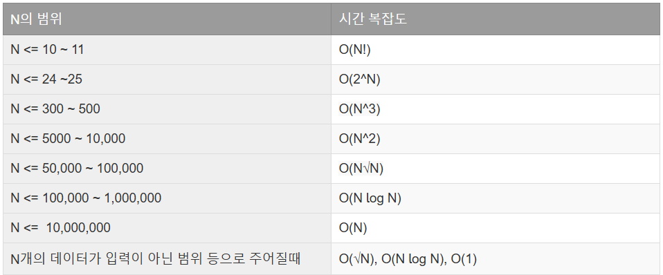
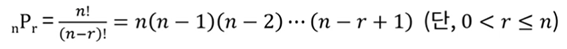

## 함수
### StringTokenizer
1. st.countTokens()는 "I'm the best in the world"에서 6을 반환한다. 토큰 개수를 세는 것이다. 
2. st.nextToken("delimeter")를 하면 구분자를 정할 수 있다.
### String
1. String.format()은 %d, %.2f 이런걸 쓸 수 있다.
2. str.toCharArray()는 문자열을 문자 배열로 바꾸는 것이다.
### Map
1. map.getOrDefault(key, defaultValue)를 좀더 자주 써보도록 하자.
2. map.entrySet().removeIf(...) 이런식으로 우회해서 removeIf를 사용할 수 있다.
### List
1. list.remove(int index)처럼 int를 넣으면 index가 제거되고 list.remove(Object o)처럼 Wrapper 클래스를 넣으면 해당하는 애가 지워진다.(여러개라면 가장 먼저 있는게 지워짐)
2. list.removeIf(x -> x % 2 == 0); // 짝수 제거 이런식으로 쓸 수도 있다. 이놈은 Collection 인터페이스에 정의된 디폴트 메소드로 Set, Map에서도 사용가능하다.
### Math
1. Math.round, Math.ceil, Math.floor은 모두 정수로만 만들 수 있다.
2. 소수점 N번째 자리까지 반올림하고 싶다면 다음과 같이 진행해야 한다.
```
   double x = 3.14159;
   double rounded = Math.round(x * 100.0) / 100.0;
   System.out.println(rounded); // 3.14
```
3. 정밀한 소수 계산을 하고싶다면 BigDecimal을 사용해야한다.
4. Math.rint()는 .5일 때 가장 가까운 짝수로 반올림한다는 특이한 녀석이다.

## 자료형
1. int의 범위는 -2,147,483,648 ~ 2,147,483,647이다.
2. List<String> list = new ArrayList<>(set); 처럼 set은 List에 바로 넣을 수 있다.
3. int mid = left + (right - left) / 2;하면 오버플로우 방지 가능
### 자료형 변환


## 시간 및 공간 제한

한 이정도 되면 그낭하다고 보면 된다.(물론 어림짐작이니 맹신은 금물. CPU의 클록 속도, 1클록마다 수행할 수 있는 CPU 명령어의 수, 프로그램의 메모리 접근 패턴, 운영 체제와 컴파일러의 버전 등등.. 생각하자면 끝도 없다.)
아래는 GPT에다가 물어본 내용이다.
[시공간범위.md](../%EC%95%8C%EA%B3%A0%EB%A6%AC%EC%A6%98/%EC%8B%9C%EA%B3%B5%EA%B0%84%EB%B2%94%EC%9C%84.md)

### ✅ Java에서 자료구조별 일반적인 크기 한도 (코딩 테스트 기준)
| 자료구조              | 일반적인 안전 범위     | 제한 요소                         |
|-----------------------|------------------------|------------------------------------|
| 배열 (`int[]`)        | 약 `10⁷` (천만 개)      | 메모리 (약 40MB)                  |
| `ArrayList`           | 약 `10⁷` (천만 개)      | 내부 배열 기반                    |
| `Deque` (`ArrayDeque`) | 약 `10⁶ ~ 10⁷`          | 배열 기반 (Queue보다 빠름)        |
| `LinkedList`          | 약 `10⁶ ~ 10⁷`          | 노드 기반, 느리지만 동적          |
| `HashMap` / `HashSet` | 약 `10⁶ ~ 10⁷`          | 해시 충돌과 부하율 고려           |
| `PriorityQueue`       | 약 `10⁶ ~ 10⁷`          | 내부 힙 배열 구조                 |
| `boolean[]` / `char[]`| 최대 `5×10⁷` 이상도 가능 | 타입당 메모리 사용량 낮음 (1~2B)  |

1. Java 연산 속도에서는 **보통 1초당 약 10^8(1억)번의 연산이 가능하다고 가정**할 수 있음.
2. **int 배열은 대략 1000만개까지 가능하다고 생각하면 편할듯**하다.


## 그 외
1. 자바에서는 나머지 연산시 분자의 부호를 따라간다. 파이썬은 분모의 부호를 따라간다.(계산법이 조금 다름)
2. 이항계수는 조합이다.

## 시간 계산(시간복잡도 아님 => 예시 문제 = 백준의 알람 시계)
가끔 어느 문제에서 기나에 관련된 문제가 나온다. ex) 6시 30분에서 50분을 더하면 7시 20분
이를 구하는 방법은 여럿 있지만 조건문을 사용하지 않는 방법은 다음과 같다.
아래와 같은 느낌이다.
```
    int total = (H * 60 + M - 45 + 1440) % 1440; // 음수 보정(분 단위), 1440 = 24 * 60, 45는 빼거나 더하는 수
    H = (total / 60;
    M = (total % 60;
```

## 정렬
### 배열 정렬
#### 1차원 배열 정렬
** java에서 int[]와 같은 기본형 배열은 comparator를 사용할 수 없다.
1. 오름차순 정렬
Arrays.sort(arr);
2. 내림차순 정렬
   1. Wrapper 클래스 사용
      ```
      Integer[] arr = {5, 2, 9, 1, 5, 6};
      Arrays.sort(arr, Collections.reverseOrder()); // 내림차순 정렬
      ```
   2. List 사용
      ```
      list.sort(Collections.reverseOrder());
      ```

### 안정 정렬(Stable sort)
정의 : 같은 값일 때, 원래의 입력 순서가 유지되는 정렬
**✅ Java의 정렬 메서드 안정성**
| 메서드 | 안정 정렬 여부 | 정렬 알고리즘 |
|--------|----------------|----------------|
| `Arrays.sort(Object[])` | ✅ **Stable** | TimSort (Java 7 이상) |
| `Arrays.sort(primitive[])` (예: int[]) | ❌ **Unstable** | Dual-Pivot QuickSort |
| `Collections.sort(List)` | ✅ **Stable** | TimSort |

### 그 외
1. 비교시 오버플로우를 방지하고 싶으면 Integer.compare(a, b) 이런식으로 하면 된다.

## 탐색
### 이진탐색(이분탐색)
**정렬된 배열 또는 리스트에 적합한 고속 탐색 방법**이다.
- 배열의 중앙에 있는 값을 조사하여 찾고자 하는 항목이 왼쪽 또는 오른쪽 부분 배열에 있는지를 알아내어 **탐색의 범위를 반으로 줄인다.**
- 찾고자 하는 값이 속해있지 않은 부분은 전혀 고려할 필요가 없기 때문에, 매 **단계에서 검색해야 할 리스트의 크기를 반으로 줄일 수 있다.**
- 이러한 방법을 반복적으로 사용해 탐색하는 방법이 이진 탐색이다.
- **데이터의 삽입이나 삭제가 빈번할 시에는 적합하지 않고, 주로 고정된 데이터에 대한 탐색에 적합**하다.
- **시간복잡도는 O(logN)이다.**
**주요 사용처 : **
1. **어떤 값 X를 구하고 싶은데, 그 값을 기준으로 결과가 “불가능 → 가능” 또는 “1 → 0”처럼 경계가 딱 나뉘는 경우, 이분탐색을 사용할 수 있다.**
2. 최댓값/최솟값 중 조건을 만족하는 "경계값"을 찾을 때
3. 어떤 “조건을 만족하는 최소 시간, 최소 거리, 최소 비용” 구할 때
4. 정답이 yes/no 형태로 경계가 있는 함수일 때

코드 링크 : [BinarySearch.java](../알고리즘/search/code/BinarySearch.java)


## 동적계획법(Dynamic Programming = DP)
### 상향식(Bottom-up)
- **반복문을 사용하여 작은 값부터 차례로 계산하여 큰 값을 채워나가는 방식**
- 재귀를 사용하지 않고, DP 테이블을 직접 채움
- 모든 값을 한 번만 계산하므로 매우 빠름
- 메모이제이션(Top-down)과 다르게 처음부터 끝까지 값을 직접 채움
- **일반적으로 반복문으로 구현!**
### 하향식(Top-down)
#### 메모이제이션(Memoization)
- 재귀(Top-down) 방식에서 **이미 계산한 값을 저장하고 다시 사용하는 기법**
- **같은 값을 여러 번 계산하지 않도록 캐싱(Cache)**
- 하향식(Top-down) 방식에서 사용됨
- 예제: f(3)을 구할 때, f(2)가 필요하면 이미 저장된 값을 재사용하는 방식
- **일반적으로 재귀 + 메모이제이션으로 구현!**

## 그리디 알고리즘(Greedy Algorithm)
문제 유형	설명	예제
- 거스름돈 문제	가장 큰 단위의 동전부터 선택	동전 개수 최소화
- 활동 선택 문제	가장 빨리 끝나는 활동 선택	회의실 배정 문제
- 배낭 문제(부분 배낭)	단위 가치가 높은 아이템부터 선택	Fractional Knapsack (무게 비례)
- 최단 경로 (다익스트라)	현재 가장 짧은 경로부터 확정	다익스트라 알고리즘
- 최소 신장 트리(MST)	가장 적은 비용의 간선 선택	크루스칼 알고리즘

# 수학(Mathmetics)
## 순열, 조합, 부분집합
[수열, 순열, 조합](https://nukoori.tistory.com/39?category=1078798)
### 순열
정의 : 서로 다른 n개의 원소에서 r개를 중복없이 순서에 상관있게 선택하는 혹은 나열하는 것을 순열이라고 한다.

대충 이런 느낌이다. 각각에 대한 코드는 다음과 같다.
- [순열(개수구하기)]([Permutation_calc.java](../%EC%95%8C%EA%B3%A0%EB%A6%AC%EC%A6%98/mathmetics/Permutation_calc.java))
- [순열(조합구하기)]([Permuation.java](../%EC%95%8C%EA%B3%A0%EB%A6%AC%EC%A6%98/mathmetics/Permuation.java))
- [중복순열]([Permutation_duplicate.java](../%EC%95%8C%EA%B3%A0%EB%A6%AC%EC%A6%98/mathmetics/Permutation_duplicate.java))
- 원순열 - 모든 r개의 순열을 만들고, 순열을 회전시켜 사전순 가장 빠른걸로 변환하고 Set으로 저장해서 중복저장하는 방법밖에 없을까?
- [팩토리얼]([Factorial.java](../%EC%95%8C%EA%B3%A0%EB%A6%AC%EC%A6%98/mathmetics/Factorial.java))
### 조합
조합은 서로 다른 n개의 원소에서 r개를 중복도 없고 순서도 상관없게 선택하는 경우의 수이다. 순열과 다른 부분은 어떤 순서로 원소를 선택했는지는 중요하지 않다는 점이다.
- [조합(개수구하기)]([Combination_calc.java](../%EC%95%8C%EA%B3%A0%EB%A6%AC%EC%A6%98/mathmetics/Combination_calc.java))
- [조합(조합구하기)]([Combination.java](../%EC%95%8C%EA%B3%A0%EB%A6%AC%EC%A6%98/mathmetics/Combination.java))
- [중복조합]([Combination_duplicate.java](../%EC%95%8C%EA%B3%A0%EB%A6%AC%EC%A6%98/mathmetics/Combination_duplicate.java))
### 부분집합
어떤 집합 S의 모든 원소를 선택하거나 선택하지 않는 모든 경우의 조합이다. 원소 개수가 N개라면 부분집합 수는 2^N이다.(공집합도 포함하면)
- [부분집합(재귀 & 비트마스킹)]([SubSet.java](../%EC%95%8C%EA%B3%A0%EB%A6%AC%EC%A6%98/mathmetics/SubSet.java))

## 지수, 로그
### 지수(거듭제곱, Exponentiation) 
정의 : a^b: a를 b번 곱한 값
- **일반적으로는 Math.pow(a, b)** 이런식으로 사용한다.
- **e^a는 Math.exp(a)** 이런식으로 사용한다.
### 로그(Logarithm)
정의 : log_b(a) = 어떤 b의 몇 제곱이 a가 되는가
- Java에서는 기본적으로 밑이 e (자연로그) 인 Math.log()만 지원한다.
- 자연로그 ln(x) = Math.log(x)
- 상용로그(밑이 10인 경우) = Math.log10(x)
- 밑이 a인 로그 = Math.log(x) / Math.log(a) 이런식으로 쓴다.

## 소수, 약수
### 약수(Divisor)
정의 : 어떤 수 N의 약수란, N을 나누어 떨어지게 만드는 수.
**구현방법**
1. 단순 완전 탐색 - O(N)
2. 해당 수의 반까지만 반복문을 진행 - O(2/N)
3. N의 약수를 구할 때는, 1부터 N의 제곱근 까지의 수만 0으로 나누어 떨어지는지 확인하면 된다는 점을 이용한 방법 - O(sqrt(N))(정렬은 안되어있음)
**[구현코드]([Divisor.java](../%EC%95%8C%EA%B3%A0%EB%A6%AC%EC%A6%98/mathmetics/Divisor.java))**
### 소수(Prime Number)
정의 : 1과 자기 자신만을 약수로 가지는 자연수(1은 제외)
**구현방법**
1. 단순 완전 탐색 - O(N)
2. √N까지만 검사 - O(√N)
3. 에라토스테네스의 체 (Sieve of Eratosthenes) - O(N log log N)
**[구현코드]([PrimeNumber.java](../%EC%95%8C%EA%B3%A0%EB%A6%AC%EC%A6%98/mathmetics/PrimeNumber.java))**
### GCD(최대공약수)/LCM(최소공배수)
GCD(Greatest Common Divisor) 정의 : 두 수 또는 여러 수의 공통된 약수 중 가장 큰 값
**구현방법**
1. 반복문으로 약수 구하기 - (O(min(a, b)))
2. 유클리드 호제법(GCD(a, b) = GCD(b, a % b)) - (O(log N))
LCM (Least Common Multiple) 정의 : 두 수 또는 여러 수의 공통된 배수 중 가장 작은 값
**구현방법**
1. GCD를 이용한 방법 - LCM(a, b) = (a * b) / GCD(a, b)
   **단, a * b가 큰 경우 오버플로우 주의 (long 타입 쓰기)**
**[구현코드]([gcdlcm.java](../%EC%95%8C%EA%B3%A0%EB%A6%AC%EC%A6%98/mathmetics/gcdlcm.java))**
### 소인수분해 (Prime Factorization)
정의 : 어떤 수 N을 **소수들의 곱으로 표현하는 것**  
예) 60 = 2² × 3 × 5
**구현 방법**
1. 기본 방식 (√N까지 나눠보기) – `O(√N)`
   - 2부터 √N까지 나누어 떨어지는 수들을 찾고
   - 그 수로 나누어질 때마다 N을 계속 나눠줌
   - 마지막에 남은 수가 있다면 그것도 소인수
2. 소수를 미리 구해두고 분해하기 (Sieve + Factorization) – `O(N log log N + log N)`
   - 여러 수를 소인수분해해야 할 때 유리
   - 에라토스테네스의 체로 소수를 구한 뒤, 그 소수들로 나누기
3. SPF 방식 (Smallest Prime Factor 배열) – `O(N log log N)` + `각 수마다 log N` -> 얘가 제일 빠름
   - 미리 **모든 수에 대해 가장 작은 소인수 저장(배열에)**
   - 매우 빠르게 소인수 분해 가능 (선형에 가까움)
**[구현코드1]([PrimeFactorization1.java](../%EC%95%8C%EA%B3%A0%EB%A6%AC%EC%A6%98/mathmetics/PrimeFactorization1.java))**
**[구현코드2]([PrimeFactorization2.java](../%EC%95%8C%EA%B3%A0%EB%A6%AC%EC%A6%98/mathmetics/PrimeFactorization2.java))**
**[구현코드3]([PrimeFactorization3.java](../%EC%95%8C%EA%B3%A0%EB%A6%AC%EC%A6%98/mathmetics/PrimeFactorization3.java))**