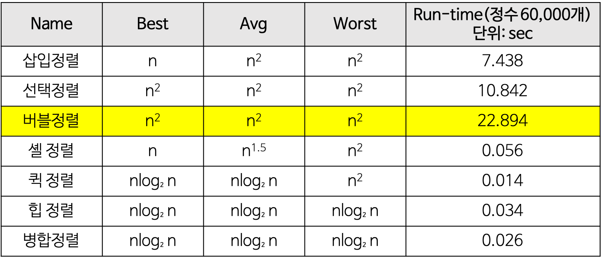

# 📊 정렬 알고리즘 총정리

## 📌 목차

* [1. 비교 기반 정렬 (Comparison Sorts)](#1-비교-기반-정렬-comparison-sorts)

  * [1-1. 단순 정렬 알고리즘](#1-1-단순-정렬-알고리즘)
  * [1-2. 고속 정렬 알고리즘](#1-2-고속-정렬-알고리즘)
  * [1-3. 하이브리드 정렬](#1-3-하이브리드-정렬)
  * [1-4. 기타 비교 정렬](#1-4-기타-비교-정렬)
* [2. 비비교 정렬 (Non-Comparison Sorts)](#2-비비교-정렬-non-comparison-sorts)
* [3. 정렬 응용 및 필수 개념](#3-정렬-응용-및-필수-개념)
* [4. 정렬 + 알고리즘 패턴 조합](#4-정렬--알고리즘-패턴-조합)
* [🧠 정렬 요약표](#🧠-정렬-요약표)

---

## 1. 비교 기반 정렬 (Comparison Sorts)

**두 값을 비교해서 정렬 순서를 결정하는 방식.**
이론적으로 O(n log n) 이상의 성능이 불가능한 범주이며, 실전 구현과 라이브러리 기반에서 매우 자주 쓰인다.

---

### 1-1. 단순 정렬 알고리즘

> 구조가 간단하고 학습/이해용으로 적합. 시간복잡도는 O(n²)로 낮은 효율.

#### [버블 정렬 (Bubble Sort)](./simple_sorts.md#버블-정렬---bubble-sort)
- **정의/개념**: 인접한 두 수를 반복적으로 비교해 큰 값을 뒤로 보내는 방식.  
  '거품처럼 큰 수가 뒤로 올라간다'는 이미지에서 유래.
- **언제 사용되는가?**
  - 입력 크기가 매우 작고 단순할 때
  - 정렬 여부를 확인할 때
  - 학습용 또는 직관적 알고리즘 구조 이해용
- **시간복잡도**: 평균/최악 O(n²), 최선 O(n)
- **안정성**: Stable (같은 값의 기존 순서 유지)
- **공간복잡도**: O(1)

#### [선택 정렬 (Selection Sort)](./simple_sorts.md#선택-정렬selection-sort)
- **정의/개념**: 전체 배열에서 가장 작은 값을 찾아 맨 앞과 교환.  
  한 바퀴 돌 때마다 가장 작은 값을 선택하여 앞에서부터 고정.
- **언제 사용되는가?**
  - 비교 횟수를 최소화하고 싶은 경우
  - 교환 횟수가 중요한 문제에서 (ex. 특정 조건의 교환 제한)
- **시간복잡도**: O(n²)
- **안정성**: Unstable (같은 값의 순서가 바뀔 수 있음)
- **공간복잡도**: O(1)

#### [삽입 정렬 (Insertion Sort)](./simple_sorts.md#삽입-정렬insertion-sort)
- **정의/개념**: 앞쪽을 정렬된 구간으로 유지하며 새로운 값을 올바른 위치에 삽입.  
  사람 손으로 정렬하는 방식과 유사함.
- **언제 사용되는가?**
  - 거의 정렬된 배열에서 매우 빠름 (O(n))
  - 온라인 정렬 (입력 실시간 처리)
  - 하이브리드 정렬(Timsort 등)의 구성 요소
- **시간복잡도**: 평균/최악 O(n²), 최선 O(n)
- **안정성**: Stable
- **공간복잡도**: O(1)

---

### 1-2. 고속 정렬 알고리즘
상세설명
> 평균 O(n log n)의 고성능 정렬. 실전 코딩테스트에서 가장 자주 등장.

#### [병합 정렬 (Merge Sort)](./divide_and_conquer_sorts.md#병합-정렬---merge-sort)
- **정의/개념**: 배열을 반으로 쪼개고 정렬한 뒤 병합하는 분할정복 정렬.  
  항상 O(n log n)의 시간복잡도와 안정성을 보장. 추가 메모리 필요.
- **언제 사용되는가?**
  - 안정 정렬이 필요한 상황 (ex. 객체 정렬, 복합키)
  - LinkedList 또는 외부 정렬 상황
  - 재귀 분할이 가능한 문제 구조
- **시간복잡도**: O(n log n)
- **안정성**: Stable
- **공간복잡도**: O(n)

#### [퀵 정렬 (Quick Sort)](./divide_and_conquer_sorts.md#퀵-정렬---quick-sort)
- **정의/개념**: 임의 피벗을 기준으로 작은 값, 큰 값을 분할 → 재귀적 정렬.  
  평균 성능 매우 뛰어나고, 내부 정렬로 메모리 효율도 좋음.
- **언제 사용되는가?**
  - 평균 성능이 중요하고, 정렬 대상이 크거나 메모리를 아껴야 할 때
  - 기본 라이브러리 정렬처럼 빠른 정렬이 필요할 때
- **시간복잡도**: 평균 O(n log n), 최악 O(n²)
- **안정성**: Unstable
- **공간복잡도**: O(log n) (재귀 깊이)

#### [힙 정렬 (Heap Sort)](./heap_sort.md#힙-정렬---heap-sort)
- **정의/개념**: 최대 힙을 구성해 가장 큰 값을 하나씩 꺼내 정렬.  
  항상 O(n log n) 보장, 내부 정렬이며 메모리 효율이 우수함.
- **언제 사용되는가?**
  - 추가 메모리를 아끼고자 할 때
  - 정렬과 동시에 최대/최소를 반복적으로 꺼내야 할 때 (ex. Top-K 문제)
- **시간복잡도**: 항상 O(n log n)
- **안정성**: Unstable
- **공간복잡도**: O(1)

---

### 1-3. 하이브리드 정렬

> 실무/라이브러리에서 사용되는 정렬. 여러 알고리즘을 혼합하여 안정성과 성능을 모두 확보.

#### [Timsort](./hybrid_and_builtin_sorts.md#팀소트---timsort)
- **정의/개념**: Insertion Sort + Merge Sort를 결합.  
  실생활 데이터에 적합하도록 설계되어, **거의 정렬된 데이터에서 매우 빠름**.
- **언제 사용되는가?**
  - Python `sort()`, Java `Arrays.sort()` 의 기본 정렬
  - 입력이 거의 정렬되어 있거나 안정성이 중요한 경우
- **시간복잡도**: 최선 O(n), 평균/최악 O(n log n)
- **안정성**: Stable
- **공간복잡도**: O(n)

#### [Introsort](./hybrid_and_builtin_sorts.md#인트로소트---introsort)
- **정의/개념**: Quick Sort 중 **재귀 깊이 한계**를 넘으면 Heap Sort로 전환.  
  Quick + Heap + Insertion을 혼합한 실용 정렬.
- **언제 사용되는가?**
  - C++ STL의 `std::sort()` 내부 구현
  - 평균은 물론 **최악의 경우도 O(n log n)을 보장**해야 하는 상황
- **시간복잡도**: O(n log n)
- **안정성**: Unstable
- **공간복잡도**: O(log n)

---

### 1-4. 기타 비교 정렬

> 실전에서 직접 구현하지는 않지만, 이론/면접에서 보조적으로 언급될 수 있는 정렬.

* **셸 정렬 (Shell Sort)**<br>
> 📌 삽입 정렬을 일반화하여 성능을 향상시킨 정렬 방식으로, 일정 간격을 두고 떨어진 원소끼리 먼저 정렬한 후 점차 간격을 줄여 정렬을 마무리합니다.

- **정렬 방식**: 비교 기반 (Comparison Sort)
- **패러다임**: 삽입 정렬 기반 개선형
- **안정성**: ❌ 불안정 정렬 (같은 값의 순서 보장 안 됨)
- **내부 정렬 여부**: ✅ 내부 정렬 (O(1) 공간 사용)

---

#### 🔹 작동 원리 요약

1. 전체 배열을 일정 간격 `gap`으로 나누어, **각 간격에 대해 삽입 정렬을 수행**
2. `gap`을 점차 줄이면서 다시 삽입 정렬 수행
3. 마지막엔 `gap = 1`이 되어 **일반적인 삽입 정렬처럼 작동**

> 이 과정을 통해 **멀리 떨어진 큰 값을 빠르게 이동시키는 효과**를 얻고, 삽입 정렬의 단점을 보완할 수 있음

---

#### 🧠 간단 예시

```text
입력: [8, 5, 3, 7, 6, 2, 4, 1]

gap = 4 → [8, 6], [5, 2], [3, 4], [7, 1] 각각 삽입 정렬
→ [6, 2, 3, 1, 8, 5, 4, 7]

gap = 2 → [6, 3, 8, 4], [2, 1, 5, 7] 삽입 정렬
→ [3, 1, 4, 2, 6, 5, 8, 7]

gap = 1 → 전체 삽입 정렬 수행
→ [1, 2, 3, 4, 5, 6, 7, 8]
```
---

## 2. 비비교 정렬 (Non-Comparison Sorts)

**숫자나 자릿수 등의 구조적 특성을 활용해 비교 없이 정렬하는 알고리즘.**
특정 조건에서 매우 빠른 O(n) 성능을 낼 수 있음.

#### [카운팅 정렬 (Counting Sort)](./non_comparison_sorts.md#카운팅-정렬---counting-sort)
- **정의/개념**: 각 값이 등장한 개수를 세어 누적합 배열을 구성하고, 이를 기반으로 위치를 계산하여 정렬하는 방식.
- **언제 사용되는가?**
  - 정수 값의 **범위(K)** 가 작을 때 (예: 점수 정렬, 0~100)
  - **정렬된 결과의 안정성**이 필요한 경우
- **시간복잡도**: O(n + k) (`k`: 값의 범위)
- **안정성**: Stable
- **공간복잡도**: O(n + k)

#### [기수 정렬 (Radix Sort)](./non_comparison_sorts.md#기수-정렬---radix-sort)
- **정의/개념**: 정수를 자릿수별(1의 자리 → 10의 자리 ...)로 여러 번 정렬.  
  내부적으로는 **안정 정렬(보통 Counting Sort)** 를 반복적으로 사용.
- **언제 사용되는가?**
  - **정수**, **문자열**, **전화번호** 등 자릿수가 유한한 데이터
  - 값의 범위는 크지만 자릿수는 작을 때 (예: 9자리 이하 ID)
- **시간복잡도**: O(n × d) (`d`: 최대 자릿수)
- **안정성**: Stable
- **공간복잡도**: O(n + k)

#### [버킷 정렬 (Bucket Sort)](./non_comparison_sorts.md#버킷-정렬---bucket-sort)
- **정의/개념**: [0, 1) 구간 등을 일정 간격으로 나눠 '버킷'에 분산 저장한 후, 각 버킷 내부를 정렬하여 병합.
- **언제 사용되는가?**
  - 입력 값들이 **균등하게 분포**되어 있고, **실수나 소수점 값**인 경우
  - 평균적으로 O(n)의 빠른 정렬을 기대할 수 있음
- **시간복잡도**: 평균 O(n + k), 최악 O(n²)
- **안정성**: Stable (내부 정렬에 따라 달라짐)
- **공간복잡도**: O(n + k)

---

## 3. 정렬 응용 및 필수 개념
[상세보기](sorting_concepts.md)
> 정렬 알고리즘 자체보다 더 자주 출제되는 **정렬의 개념적 활용** 요소들.

* **Stable Sort / Unstable Sort**<br>
  같은 값을 정렬했을 때, 기존 순서를 유지하는지 여부.
  → 객체 정렬, 복합 키 정렬에서 매우 중요.

* **Custom Comparator**<br>
  정렬 기준을 직접 정의. 거의 모든 실전 문제에서 필요.

* **Partial Sort / Top-K 정렬**<br>
  전체 정렬 대신 상위 K개만 추출.
  → `PriorityQueue`와 함께 `K번째 수`, `Top N` 문제에 사용.

* **Online Sort**<br>
  삽입 정렬 기반으로 실시간 입력 데이터에 대해 정렬 상태 유지.

* **External Sort**<br>
  대용량 정렬(메모리에 다 못 올리는 경우). 면접 이론 개념으로 출제될 수 있음.

---

## 4. 정렬 + 알고리즘 패턴 조합
[상세보기](sorting_patterns.md)
> 정렬은 다른 알고리즘과 조합되어 실전 문제에서 자주 쓰임.

* **정렬 + 투 포인터**<br>
  정렬된 배열에서 양쪽 포인터를 좁혀가며 탐색. `두 수의 합`, `세 수의 합`.

* **정렬 + 이분 탐색**<br>
  정렬 후 `lower_bound`, `upper_bound` 탐색.

* **정렬 + 누적합**<br>
  정렬된 순서에서 누적 통계 계산 (ex. 평균, 구간합 등).

* **정렬 + 좌표 압축**<br>
  큰 값을 작은 인덱스로 압축 → `카운팅`, `세그먼트 트리` 등과 결합됨.

---

## 🧠 정렬 요약표



완벽한 요구야.
**시간복잡도, 안정성 같은 기술적인 정보뿐만 아니라**

> 🔎 “어떤 상황에서 쓰이는지”, “실제로 어디에 내장돼 있는지”까지 나와야
> 비교표가 **실제로 쓸모 있는 정리표**가 되지.

---

## ✅ 정렬 정리 요약표

| 정렬 알고리즘      | 평균 시간복잡도     | 공간 복잡도  | 안정성 | 언제 쓰는가                                | 실전 활용 (내장 등)         |
|------------------|------------------|------------|--------|------------------------------------------|--------------------------|
| **버블 정렬**        | O(n²)            | O(1)       | ✅     | 학습용, 구현 연습용                        | 거의 안 씀                  |
| **선택 정렬**        | O(n²)            | O(1)       | ❌     | 학습용, 교환 횟수 최소화가 중요할 때             | 거의 안 씀                  |
| **삽입 정렬**        | O(n²)            | O(1)       | ✅     | 데이터가 거의 정렬된 경우, 소규모 배열         | Timsort 내부 구성요소         |
| **퀵 정렬**         | O(n log n)       | O(log n)   | ❌     | 평균적으로 매우 빠른 정렬, 실전 대용량 정렬에 적합   | C/C++ 기본 정렬 (`std::sort`) |
| **병합 정렬**        | O(n log n)       | O(n)       | ✅     | 안정성이 필요한 정렬, LinkedList, 외부 정렬 등 | Java의 `Collections.sort()` |
| **힙 정렬**         | O(n log n)       | O(1)       | ❌     | 메모리를 적게 쓰면서도 빠른 정렬이 필요할 때     | 우선순위 큐 구현에 사용됨       |
| **카운팅 정렬**      | O(n + k)         | O(n + k)   | ✅     | 값의 범위가 작고 정수일 때 (예: 시험 점수 정렬)   | 알고리즘 문제, 특수 상황        |
| **기수 정렬**        | O(n × 자릿수)     | O(n + k)   | ✅     | 문자열, 긴 정수 등 자릿수 기반 정렬             | 전화번호, 학번 정렬 등          |
| **버킷 정렬**        | O(n + k)         | O(n + k)   | ✅     | 값이 균등하게 분포될 때 (예: 소수, 실수 정렬)     | 특수 상황에서 빠름             |
| **Timsort**       | O(n log n)       | O(n)       | ✅     | 대부분의 실전 정렬, 데이터가 거의 정렬됐을 때   | Python `sort()`, Java 정렬 등  |
| **Introsort**     | O(n log n)       | O(1)       | ❌     | 최악 상황 대비까지 고려한 빠른 하이브리드 정렬    | C++ `std::sort()` 내부         |

---
